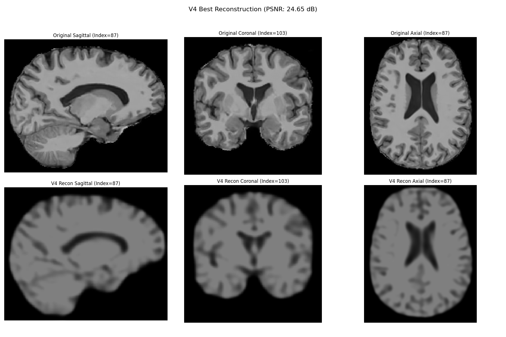
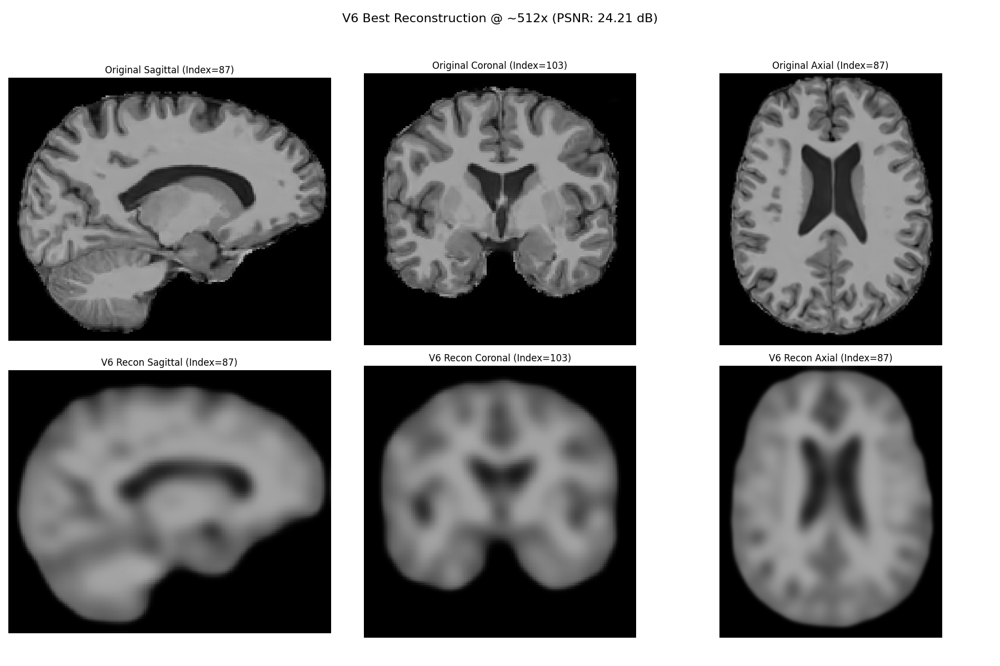
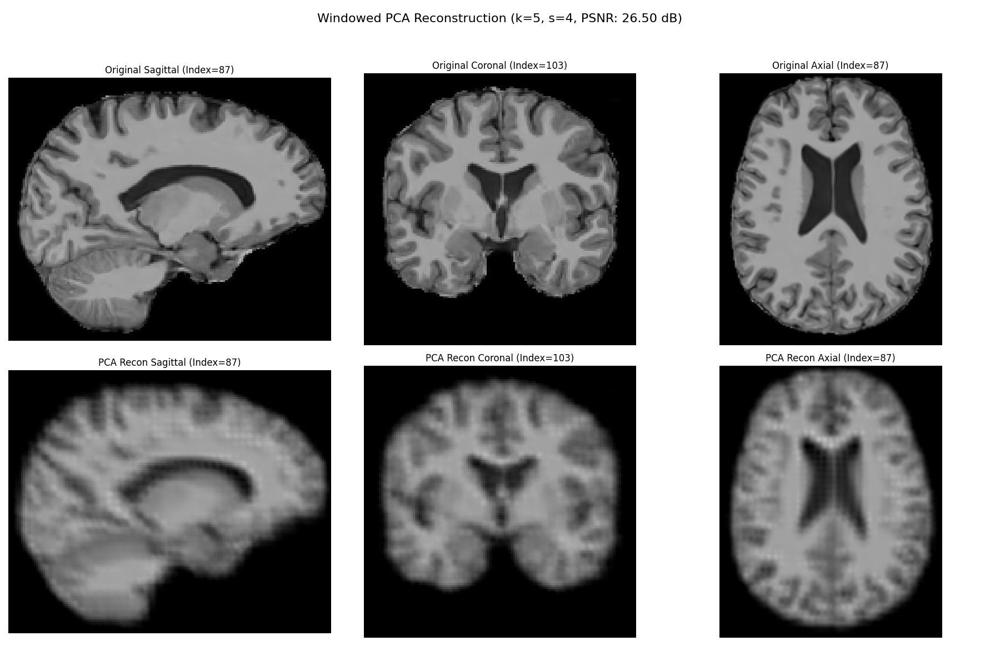
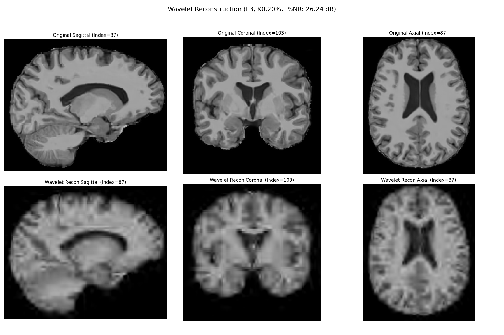

# High-Ratio 3D Brain MRI Compression Analysis (AE vs PCA vs Wavelets)

This repository documents an investigation into different methods for achieving high compression ratios (~500x) on 3D brain MRI scans, primarily using Autoencoders (AE), with comparisons to Principal Component Analysis (PCA) and Wavelet Transforms. The work was conducted on Kaggle using the Stanford AIMI dataset under the guidance of Dr. Wei Peng.

**Project Goal:** Explore compression techniques with the eventual aim of enabling downstream editing and generation tasks, while evaluating reconstruction quality using Peak Signal-to-Noise Ratio (PSNR).

## Data

*   **Source:** Stanford AIMI Brain MRI Dataset.
*   **CRITICAL LIMITATION:** Only **4 samples** were used for this initial investigation due to resource constraints. This severely limits the generalization and achievable fidelity of all models, especially deep learning approaches.

## Methods Explored

1.  **3D Convolutional Autoencoders (PyTorch):**
    *   **V1:** Shallow AE @ ~512x (Baseline Failure: ~8 dB PSNR)
    *   **V4:** Deeper AE with Upsample layers @ ~64x (Best Quality Benchmark: ~26.1 dB PSNR)
    *   **V6:** Deeper AE with Upsample layers @ ~512x (Improved High Compression: ~24.1 dB PSNR)
2.  **Principal Component Analysis (Scikit-learn):**
    *   **Windowed Overlapping Patch PCA:** (k=5 components, stride 4) - Best PCA variant (~26.5 dB PSNR)
3.  **3D Wavelet Transform (PyWavelets):**
    *   **Coefficient Thresholding:** (`db4` wavelet, level 3, keep 0.2% coeffs) - Strong classical baseline (~26.2 dB PSNR)

## Key Findings (High Compression ~500x)

| Method                 | PSNR        | Visuals                           | Editing Potential |
| :--------------------- | :---------- | :-------------------------------- | :---------------- |
| Deep AE (V6)           | ~24.1 dB    | Globally Blurry, Structure OK     | **Potentially High** |
| Windowed Overlap PCA   | **~26.5 dB**| Very Smooth, Very Blurry          | Low               |
| 3D Wavelet Threshold | **~26.2 dB**| Smooth, Wavelet Artifacts, Blurry | Low               |

*   **Architecture Matters:** Deeper AEs (V6) significantly outperform shallow ones (V1) at high compression.
*   **Classical Methods Excel Numerically (on limited data):** PCA and Wavelets achieved higher PSNR than the AE in this 4-sample scenario.
*   **Data is the Bottleneck:** All methods produced blurry results at ~500x, highlighting the severe data limitation.
*   **Latent Space vs. PSNR:** Despite lower PSNR here, the AE's learned latent space is theoretically more promising for future editing/generation tasks.

## Notebook

The complete analysis, code, and detailed explanations are in the Jupyter Notebook:
[`stanford-medicine.ipynb`](./stanford-medicine.ipynb)

A viewable version (including outputs) is also available on Kaggle:
[View on Kaggle](https://www.kaggle.com/code/ajmaliitm/stanford-medicine)

## Dependencies

Major libraries used include:
`torch`, `nibabel`, `scikit-learn`, `scikit-image`, `PyWavelets`, `matplotlib`, `numpy`.
See the first cell of the notebook for `pip install`.

## Running the Notebook

The notebook is designed to run on Kaggle with a GPU (tested on T4) and the specified dataset attached at `/kaggle/input/stanfordmed/`. Training the Autoencoders (300 epochs each) takes several hours.

## Future Work

The primary next step is to **use a much larger dataset**. Subsequent steps include retraining the AE, exploring its latent space, and potentially investigating VQ-VAE or GANs.

### Key Visual Results

| V4 AE (~64x, ~26.1dB) | V6 AE (~512x, ~24.1dB) | PCA (k=5, ~26.5dB) | Wavelet (0.2%, ~26.2dB) |
| :-------------------: | :-------------------: | :----------------: | :---------------------: |
|  |  |  |  |